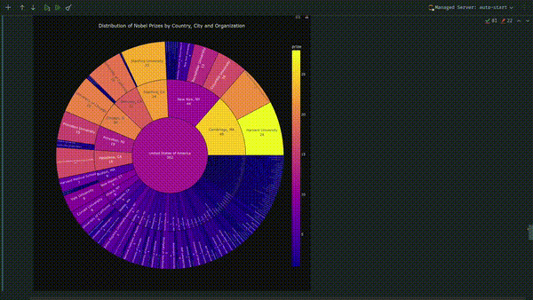
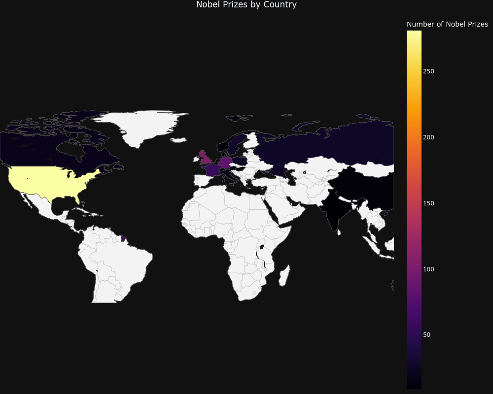
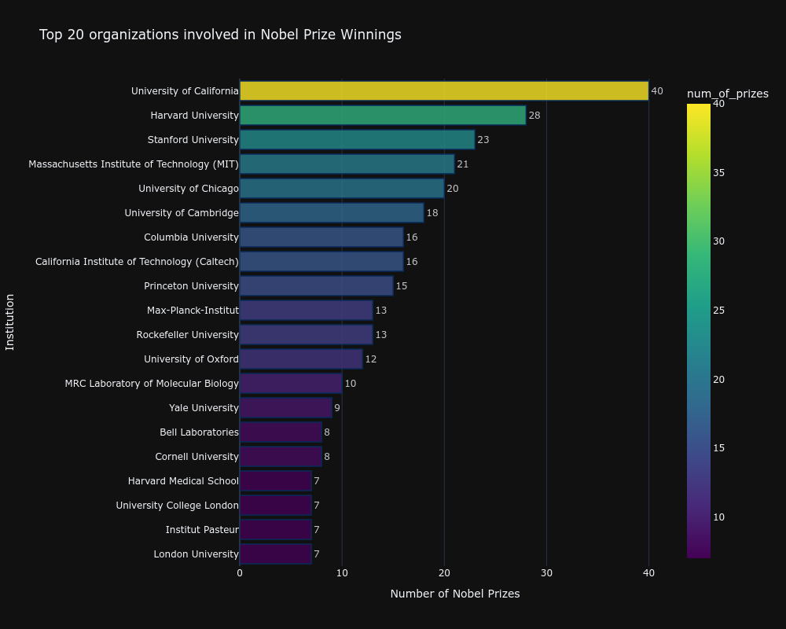
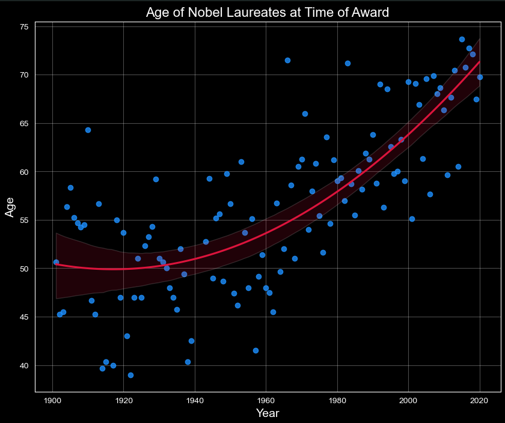

# 🏅 Nobel Prize Analysis

An interactive and insightful exploration of the Nobel Prize dataset using Python data science tools. This project dives into patterns and trends from over a century of Nobel Prize awards across various disciplines.

## 📊 Overview

Every year, the Nobel Prize honors individuals and organizations for outstanding contributions in:
- Physics
- Chemistry
- Medicine
- Literature
- Peace
- Economics

In this project, we investigate:
- Prize distribution over time
- Gender disparities among laureates
- Country-wise analysis of Nobel recipients
- Trends by category and birth demographics

## 📁 Dataset

The dataset includes historical data on Nobel laureates from 1901 onwards. It contains fields such as:
- Full name
- Year and category of award
- Gender
- Birth date and country
- Organization affiliation

(Data source details can be added here if publicly available.)

## 🔧 Technologies Used

- Python
- Jupyter Notebook
- pandas, numpy
- seaborn, matplotlib, plotly.express

## 📈 Features

- Time-series analysis of Nobel Prizes
- Gender distribution among laureates
- Heatmaps and scatter plots for geographical trends
- Interactive visualizations with Plotly

## 📈 Sample graphs






## 🏁 Getting Started

1. Clone the repository or download the `.ipynb` file.
2. Install dependencies:
   ```bash
   pip install pandas numpy matplotlib seaborn plotly

Open the notebook:

    jupyter notebook Nobel_Prize_Analysis.ipynb

📂 Project Structure

├── .git
│   ├── branches
│   ├── hooks
│   │   ├── applypatch-msg.sample
│   │   ├── commit-msg.sample
│   │   ├── fsmonitor-watchman.sample
│   │   ├── post-update.sample
│   │   ├── pre-applypatch.sample
│   │   ├── pre-commit.sample
│   │   ├── pre-merge-commit.sample
│   │   ├── pre-push.sample
│   │   ├── pre-rebase.sample
│   │   ├── pre-receive.sample
│   │   ├── prepare-commit-msg.sample
│   │   ├── push-to-checkout.sample
│   │   └── update.sample
│   ├── info
│   │   └── exclude
│   ├── objects
│   │   ├── info
│   │   └── pack
│   ├── refs
│   │   ├── heads
│   │   └── tags
│   ├── HEAD
│   ├── config
│   └── description
├── .idea
│   ├── inspectionProfiles
│   │   ├── Project_Default.xml
│   │   └── profiles_settings.xml
│   ├── .gitignore
│   ├── Nobel_Prize_winners_analysis.iml
│   ├── misc.xml
│   ├── modules.xml
│   ├── vcs.xml
│   └── workspace.xml
├── data
│   └── nobel_prize_data.csv
├── static
│   └── nobel.jpg
├── Nobel_Prize_Analysis.ipynb
├── README.md
├── requirements.txt
└── tree.py

## 📌 Example Insights

    The US and UK dominate Nobel Prize wins.

    There is a significant gender gap favoring male laureates.

    Nobel awards have broadened in diversity over time.

## 📃 License

MIT License (or specify any license you prefer)
## ✍️ Author

Created by Milos Grujic aka Gruyanidas